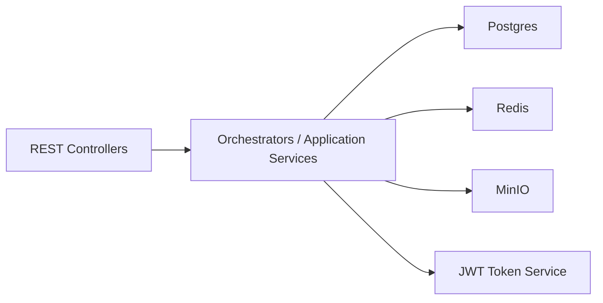
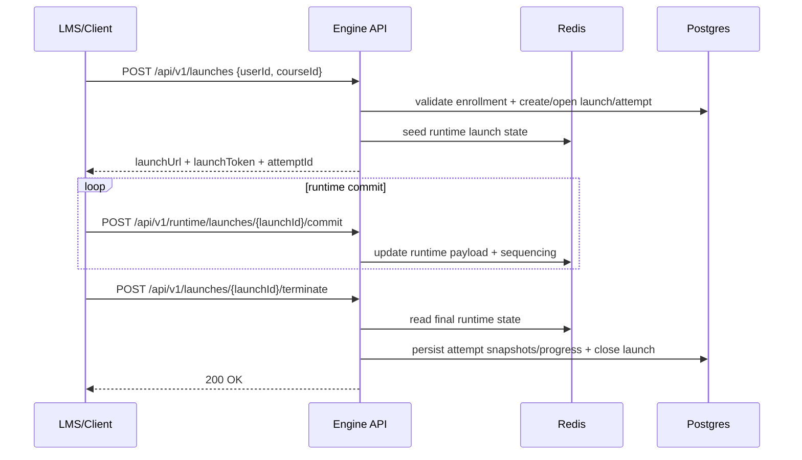

# scorm-engine

## Scope
Spring Boot REST backend for SCORM course lifecycle and runtime tracking:
- course import and manifest parsing (SCORM 1.2 / 2004)
- user + enrollment management
- launch issuance (launch URL/token)
- runtime commit ingestion
- terminate/flush to persistent progress snapshots

## Runtime
- Default HTTP port: `8080`
- OpenAPI UI: `http://localhost:8080/swagger-ui`

## External Dependencies
- Postgres (`5432`) for canonical persistence
- Redis (`6379`) for launch runtime state
- MinIO (`9000`) for uploaded/extracted package objects

## Architecture


## Request Flow (Launch Runtime)


## Local Run
```bash
cd ../central-docker-infrastructure/infrastructure
docker compose up --build
```

## Engine-only Build
```bash
docker build -t scorm-engine:local .
```

## Technical Docs
- Runbook: `docs/run/README.md`
- Contracts/architecture: `docs/memory/*`
